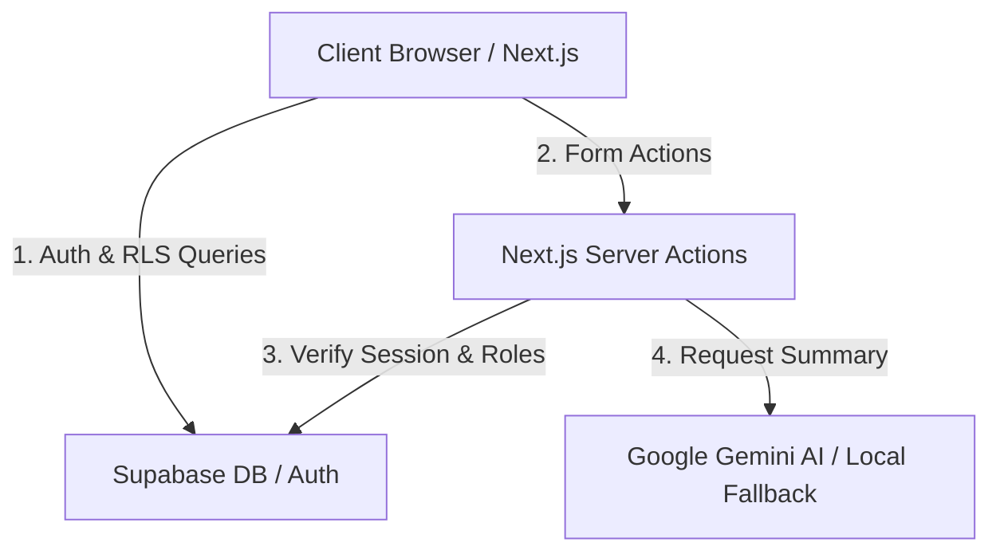

# 🌌 Chronicle AI - Premium AI-Powered Blogging Platform

Chronicle AI is a state-of-the-art, full-stack blogging platform. Engineered for speed, safety, and visual elegance, it combines a gorgeous glassmorphic interface with real-time AI summarization and secure role-based access control.

🚀 **Live Deployment Link:** [https://chronicle--ai.vercel.app/](https://chronicle--ai.vercel.app/)

---

## 🛠️ Tech Stack & Badges


---

## ⚡ Key Features

*   **🧠 Intelligent AI Summarization:** When a post is published, the platform automatically generates a professional summary using the Google Gemini 2.0 API. If the API key is restricted or hits a quota block, it seamlessly falls back to a high-quality local algorithmic summarizer.
*   **🛡️ Secure Role-Based Access Control (RBAC):** Real-time permission tracking maps accounts to three roles:
    *   `Viewer`: Reads posts and leaves comments.
    *   `Author`: Can create, edit, and manage their own stories.
    *   `Admin`: Moderates all stories and comments via a dedicated administrator dashboard.
*   **📁 Custom Media Storage:** Upload custom cover images directly into a secure Supabase Storage bucket with real-time previews.
*   **🔍 Advanced Exploration:** Server-side search filtering by keywords, pagination for large feeds, and interactive comments.
*   **✨ One-Click Demo Access:** Recruiters and testers can bypass sign-ups entirely by logging in as any role with a single click at the top of the login screen.

---

## 📊 System Architecture



---

## 🔒 Security & Database Integration

To protect content and maintain database integrity, Chronicle AI enforces database-level security policies:
1.  **Row-Level Security (RLS):** All write and delete queries are verified at the PostgreSQL level. Authors can only edit/delete their own stories, and Admins hold full moderating privileges.
2.  **Auth Synced Triggers:** A custom trigger function (`handle_new_user()`) intercepts Supabase Auth registrations and maps profiles and roles to public users automatically.

All database definitions and policies are compiled inside [supabase_setup.sql](file:///supabase_setup.sql) for easy setup.

---

## 💻 Local Installation & Setup

Follow these steps to run the project locally on your machine:

1.  **Clone the Repository:**
    ```bash
    git clone https://github.com/RaghavParasher/hivon-blog.git
    cd hivon-blog
    ```

2.  **Install Dependencies:**
    ```bash
    npm install
    ```

3.  **Configure Environment Variables:**
    Create a `.env.local` file in the root directory:
    ```env
    NEXT_PUBLIC_SUPABASE_URL=your_supabase_project_url
    NEXT_PUBLIC_SUPABASE_ANON_KEY=your_supabase_anon_key
    GOOGLE_AI_API_KEY=your_google_gemini_api_key
    ```

4.  **Database Migration:**
    Execute the statements inside `supabase_setup.sql` in your Supabase SQL Editor.

5.  **Run Development Server:**
    ```bash
    npm run dev
    ```
    Open [http://localhost:3000](http://localhost:3000) in your browser.

---
**Built with ❤️ by Raghav Parasher.**